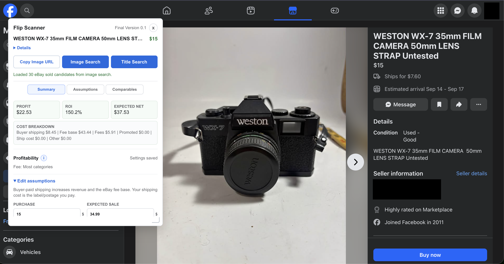

# Marketplace Flip Scanner

A Chrome extension that compares individual Facebook Marketplace listings with eBay sold listings and estimates potential resale profit.



## Features

- Captures the listing title, asking price, main image, and Marketplace URL.
- Searches eBay sold listings by title or by the Marketplace image.
- Shows the sold candidates used in the analysis and explains excluded matches.
- Calculates median and average sale prices, expected net proceeds, profit, and ROI.
- Supports editable eBay fees, promoted-listing fees, shipping, packaging, and other costs.
- Saves calculation assumptions and panel preferences with Chrome storage.
- Runs entirely in the browser with no API key or separate server.

## Install

This project is distributed as an unpacked Chrome extension.

1. Clone this repository or download and extract its ZIP archive.
2. Open `chrome://extensions` in Chrome.
3. Turn on **Developer mode**.
4. Click **Load unpacked**.
5. Select the repository folder containing `manifest.json`.

After changing the source, return to `chrome://extensions` and reload the extension.

## Usage

1. Open an individual Facebook Marketplace listing.
2. Use the **Flip Scanner** panel that appears on the page. The extension popup can show the panel manually or disable automatic opening.
3. Choose an eBay workflow:
   - **Image Search** submits the captured listing image to eBay and gathers sold matches.
   - **Title Search** searches eBay sold listings using the captured title.
   - **Copy Image URL** copies the captured image address for a manual image search.
4. Review the summary and underlying comparables.
5. Adjust purchase price, expected sale price, fees, shipping, and other assumptions before making a decision.

## How the Estimate Works

The extension filters parsed eBay sold listings using title similarity and price-outlier checks. The median price of the accepted comparables becomes the default expected sale price. Profit is calculated from the expected sale price, buyer-paid shipping, estimated eBay and promoted-listing fees, postage, packaging, other expenses, and the Marketplace purchase price.

Fee-category detection is only a suggestion. Actual eBay fees vary by listing category, seller account, store subscription, order total, and policy changes. Every assumption remains editable.

## Permissions and Privacy

Marketplace Flip Scanner has no analytics, advertising, remote backend, or API-key requirement. Listing details are processed locally between the open Facebook and eBay tabs. Only preferences and calculation assumptions are saved in Chrome storage.

The extension requests:

- Access to individual Facebook Marketplace listing pages to read listing details and display the panel.
- Access to eBay pages to run searches and read sold-listing results.
- `storage` to remember preferences and calculation assumptions.
- `activeTab` so the popup can communicate with the Marketplace tab selected by the user.
- `clipboardWrite` for the **Copy Image URL** action.

Diagnostic details are written to the browser's DevTools console to help troubleshoot website markup changes. They are not sent to the project author or another service.

## Limitations

- Facebook and eBay can change their page structure at any time, which may temporarily break extraction.
- eBay image search is best-effort and may stop if eBay displays a verification page or changes its image-search controls. Title search and manual image-URL copying remain available as fallbacks.
- Sold-listing matches and profit calculations are estimates, not guarantees or financial advice. Verify item condition, authenticity, demand, fees, taxes, shipping, and transaction risk independently.
- The extension is intended for lawful personal research. Users are responsible for following Facebook's and eBay's terms and applicable rules.

## Development

The project uses plain JavaScript, HTML, and CSS with no build step or runtime dependencies. Run the checks from the repository root:

```sh
node --check src/extractor.js
node --check src/content.js
node --check src/background.js
node --check src/ebaySearch.js
node --check src/ebayResults.js
node --check src/ebayImageSearch.js
node --check src/comps.js
node --check src/profitability.js
node --check src/popup.js

node test/stage1-smoke.test.js
node test/stage2-ebay-search.test.js
node test/stage3-comps.test.js
node test/stage3-ebay-results.test.js
node test/stage4-profitability.test.js
node test/stage5-ebay-image-search.test.js
node test/stage6-background-lifecycle.test.js
```

Bug reports should include the affected page type, the action attempted, and relevant `[Marketplace Flip Scanner]` console output with personal information removed.

## Disclaimer

This independent project is not affiliated with, endorsed by, or sponsored by Meta, Facebook, or eBay. Facebook, Marketplace, and eBay are trademarks of their respective owners.
